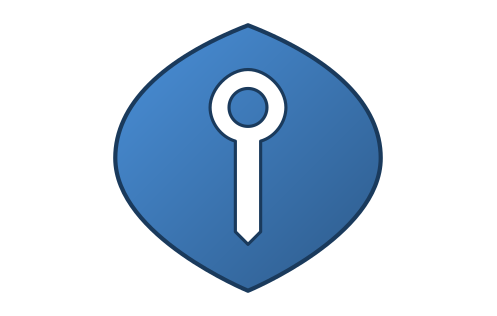

# Kubidm - Simple and Secure Identity Management

> **This repository is an independent fork of [Kanidm](https://github.com/kanidm/kanidm).**
>
> We started this fork because our product direction and development priorities have diverged from the upstream project.
>
> Our focus is on:
>
> - **Modern distributed operations**: machine-readable, idempotent lifecycle, replication, recovery, and maintenance primitives designed for external reconciliation rather than human-only runbooks.
> - **Cloud-native and Kubernetes-friendly operations**: including modern deployment patterns, object-store backups, health and capability interfaces, and tighter Kubernetes integration.
> - **Enterprise-ready Workforce IAM**: extending the platform toward the requirements of larger production deployments.
>
> We also embrace contemporary development practices, including LLM-assisted workflows and tooling that support faster iteration. These are development methods rather than a runtime requirement or product architecture dependency.
>
> This fork reflects a different roadmap, not a lack of appreciation for upstream. We are grateful to the original maintainers for building and sustaining Kanidm, and this work would not exist without that foundation.
>
> If you are using this fork, please report bugs, request features, and seek support through this repository and its associated community channels. As our implementation and priorities differ from upstream, fork-specific issues are best handled here rather than in the upstream Kanidm project. We aim to respond to feedback as quickly as possible and to keep our release cycle fast so fixes and improvements can reach users sooner.
>
> **Special thanks to** [@firstyear](https://github.com/firstyear) and [@yaleman](https://github.com/yaleman) for creating and maintaining Kanidm.

## About

Kubidm is a simple and secure identity management platform, allowing other applications and services to offload the
challenge of authenticating and storing identities to Kubidm.

The goal of this project is to be a complete identity provider, covering the broadest possible set of requirements and
integrations. You should not need any other components (like Keycloak) when you use Kubidm - we already have everything
you need!

To achieve this we rely heavily on strict defaults, simple configuration, safe recovery semantics, and
automation-friendly operational interfaces. This allows Kubidm to support small home labs, families, small businesses,
and all the way to the largest enterprise needs.

If you want to host your own authentication service, then Kubidm is for you!

## Operational Direction

Kubidm separates distributed-system correctness from infrastructure orchestration.

**Kubidm owns identity, database, replication, recovery, and maintenance semantics. External control planes own desired
topology, placement, workload lifecycle, rollout sequencing, and reconciliation.**

The project therefore prefers small, explicit, machine-oriented operational primitives over embedding a second generic
cluster orchestration system into the identity server. Controllers should be able to observe and request safe Kubidm
state transitions without parsing logs, depending on CLI formatting, sleeping for assumed convergence intervals, or
reimplementing replication logic.

Kubernetes is a primary orchestration environment for Kubidm, but it is not a runtime dependency of `kubidmd`. Simple
deployments can continue to use systemd or containers directly, while distributed automation can compose the same
server-side semantic primitives from Kubernetes operators or other reconcilers.

See the [Operational Model](book/src/operational_model.md) for the user-facing model and the
[Orchestration Boundary](book/src/developers/designs/orchestration_boundary.md) design decision for the detailed
responsibility split.

  
Supported Features

Kubidm supports:

- Passkeys (WebAuthn) for secure cryptographic authentication
  - Attested passkeys for high security environments
- Application Portal allowing easy access to linked applications
- OAuth2/OIDC authentication provider for SSO
- OAuth2/OIDC service access with token exchange services
- Linux/Unix integration with TPM protected offline authentication
- SSH key distribution to Linux/Unix systems
- RADIUS for network and VPN authentication
- Read-only LDAPs gateway for Legacy Systems
- Complete CLI tooling for Administration
- Two node high availability using database replication
- A WebUI for user self-service
- And more!

## Documentation / Getting Started / Install

If you want to read more about what Kubidm can do, you should read our documentation.

- [Kubidm book (latest stable)](https://kubidm.github.io/kubidm/stable/)

We also have a set of [support guidelines](https://github.com/kubidm/kubidm/blob/master/book/src/support.md) for what
the project team will support.

## Code of Conduct / Ethics

All interactions with the project are covered by our [code of conduct].

When we develop features, we follow our project's guidelines on [rights and ethics].

[code of conduct]: https://github.com/kubidm/kubidm/blob/master/CODE_OF_CONDUCT.md
[rights and ethics]: https://github.com/kubidm/kubidm/blob/master/book/src/developers/developer_ethics.md

## Getting in Contact / Questions

We have a Matrix-powered [gitter community channel] where project members are always happy to chat and answer questions.
Alternately you can open a new [GitHub discussion].

[gitter community channel]: https://app.gitter.im/#/room/#kubidm_community:gitter.im
[github discussion]: https://github.com/kubidm/kubidm/discussions

## What does Kubidm mean?

Kubidm is a portmanteau of 'Kubi' and 'idm'. Kubi refers to Kubernetes, reflecting this fork's focus on cloud-native
and Kubernetes-friendly operations. Identity management is often abbreviated to 'idm', and is a common industry term
for authentication providers.

Kubidm is pronounced as "koo - bee - dee - em".

## Kubidm Anthem

> An anthem is a popular song, especially a rock song felt to sum up the attitudes or feelings associated with a period
> or social group.

The Kubidm anthem is [Crab Rave - Noisestorm](https://www.youtube.com/watch?v=LDU_Txk06tM)

## Comparison with other services

 
LLDAP

[LLDAP](https://github.com/nitnelave/lldap) is a similar project focused on providing a small, easy-to-administer LDAP
server with a web administration portal. Both LLDAP and Kubidm use the
[Kanidm LDAP bindings](https://github.com/kanidm/ldap3) and share many common design ideas.

The primary advantage of Kubidm over LLDAP is its broader built-in feature set, including native support for OAuth2 and
OIDC. In contrast, LLDAP requires integration with an external portal like Keycloak to provide these features. However,
LLDAP's simplicity — offering fewer features — can make it easier to deploy and manage for certain use cases.

While LLDAP provides a simple Web UI as the main user management interface, Kubidm currently offers administrative
functionality primarily via its CLI, with its Web UI designed more for user interactions than for administration.

If Kubidm feels too complex for your needs, LLDAP is a smaller and simpler alternative. But if you want a more
feature-rich solution out of the box, Kubidm will likely be a better fit.

 
389-ds / OpenLDAP

Both 389 Directory Server (389-ds) and OpenLDAP are general-purpose LDAP servers. They provide LDAP functionality only,
so you must supply your own Identity Management (IDM) components—such as an OIDC portal, self-service web UI,
command-line tools for administration, and more.

If you require maximum customization of your LDAP deployment, 389-ds or OpenLDAP may be better choices. However, if you
prefer an easy-to-set-up service focused specifically on IDM, Kubidm is a superior option.

Kubidm draws inspiration from both 389-ds and OpenLDAP and already matches or exceeds 389-ds in directory service
performance and scalability, while offering a richer feature set.

 
FreeIPA

FreeIPA is a comprehensive identity management system for Linux/Unix, bundling many services including LDAP, Kerberos,
DNS, and a Certificate Authority.

However, FreeIPA is complex, consisting of numerous components and configurations, which leads to higher resource usage
and administrative overhead during setup and upgrades.

Kubidm aims to offer the feature richness of FreeIPA but with a lighter resource footprint and simpler management. In
benchmarks with 3,000 users and 1,500 groups, Kubidm demonstrated approximately three times faster search operations and
five times faster modifications and additions (results may vary, but Kubidm generally outperforms FreeIPA in speed).

If you want a full IDM solution that's easier to manage and more efficient, Kubidm is worth considering.

 
Keycloak

[Keycloak](https://github.com/keycloak/keycloak) is an OIDC/OAuth2/SAML provider that can layer WebAuthn authentication
on top of existing IDM systems. Although it can operate as a stand-alone IDM solution, it is commonly used alongside an
LDAP server or similar backend.

Deploying Keycloak requires significant configuration and expertise. Its extensive customization options for
authentication workflows can make initial setup challenging.

Kubidm does not require Keycloak to provide OAuth2 and other services. It integrates many of these capabilities in a
simpler, more streamlined way right out of the box.

 
 
Rauthy

[Rauthy](https://github.com/sebadob/rauthy) is a minimal OIDC provider supporting WebAuthn—using some of the same
libraries as Kubidm.

However, Rauthy focuses exclusively on OIDC and does not support additional use cases such as RADIUS or Unix
authentication.

If you need a minimal OIDC-only provider, Rauthy is an excellent choice. But if you require a broader feature set,
Kubidm is the better option.

 
Authentik / Authelia / Zitadel

[Authentik](https://github.com/goauthentik/authentik) (written in Python),
[Authelia](https://github.com/authelia/authelia), and [Zitadel](https://github.com/zitadel/zitadel) (both written in Go)
are IDM providers similar to Kubidm in many respects. However, all three have weaker support for Unix authentication and
do not provide the advanced authentication policies or WebAuthn Attestation capabilities that Kubidm offers.

Additionally, these projects rely on external SQL databases such as PostgreSQL, which can introduce potential single
points of failure and performance bottlenecks. In contrast, Kubidm uses its own high-performance database and
replication system, developed based on enterprise LDAP server experience.

## Developer Getting Started

If you want to contribute to Kubidm there is a getting started [guide for developers]. IDM is a diverse topic and we
encourage contributions of many kinds in the project, from people of all backgrounds.

When developing the server you should refer to the latest commit documentation instead.

- [Kubidm book (latest commit)](https://kubidm.github.io/kubidm/master/)

[guide for developers]: https://kubidm.github.io/kubidm/master/developers/index.html
