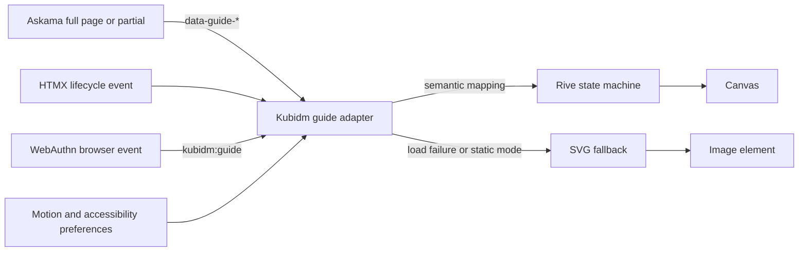

# ADR: Mascot-Guided Product Experience

- **Status:** Proposed
- **Date:** 2026-07-25
- **Decision owners:** Kubidm maintainers
- **Scope:** Kubidm Web UI, product identity, motion system, and browser-side asset delivery

## Summary

Kubidm will introduce an original crab mascot as a state-aware product guide. The mascot will accompany users through
identity workflows such as authentication, application selection, profile maintenance, credential management, and
logout.

The guide will be implemented without replacing the existing server-rendered frontend. Askama will continue to render
semantic HTML, HTMX will continue to manage partial updates, and Bootstrap and the existing CSS system will continue to
provide layout and components.

Rive will be evaluated and adopted as the preferred character-animation runtime, initially using the self-hosted
`@rive-app/canvas-lite` web runtime. A small vanilla JavaScript ES module will translate semantic Kubidm workflow states
into Rive state-machine inputs. Static SVG artwork will remain the mandatory fallback and reduced-motion experience.

The feature will be delivered incrementally. The first production pilot will replace the existing logout illustration,
followed by authentication and application selection. Profile and credential workflows will only be integrated after the
state model, accessibility, performance, and security behaviour have been validated.

## Context

Kubidm is an identity-management system where users perform security-sensitive operations. The Web UI currently covers
several distinct journeys, including:

- authentication and reauthentication;
- passkey and security-key authentication;
- OAuth2 application access;
- application selection;
- profile viewing, unlocking, editing, and saving;
- password, passkey, attested-passkey, TOTP, and other credential changes;
- policy warnings and unsaved credential changes; and
- logout confirmation.

The current frontend architecture is suitable for progressively adding a guided visual experience:

- Axum serves the UI and static assets;
- Askama renders full pages and partials;
- HTMX performs targeted replacements for profile and credential operations;
- Bootstrap supplies layout and common components;
- plain JavaScript and ES modules implement browser-specific behaviour such as WebAuthn;
- `server/core/static` is exposed under `/pkg`;
- JavaScript assets are explicitly included in the server's CSP hash generation; and
- the stylesheet already handles `prefers-reduced-motion` for existing transitions.

There is already a narrow mascot-like integration point in the sign-out modal, which renders
`/pkg/img/kubidm-waving.svg`. This provides a low-risk place to validate the new character and asset pipeline before the
guide is used in complex authentication or credential-management states.

The intended experience is not a chatbot, tutorial overlay, or animated cursor follower. It is an ambient, state-aware
visual representation of Kubidm's current workflow status. It should make the product easier to understand without
obscuring, delaying, or trivialising security operations.

## Problem statement

A set of unrelated animations embedded directly into templates would create several problems:

- route names and visual animation names would become tightly coupled;
- every new workflow would require bespoke JavaScript;
- HTMX swaps could destroy and recreate animation state unpredictably;
- severe errors could accidentally receive playful or misleading feedback;
- tenant branding and reduced-motion support would be inconsistent;
- animation-runtime failure could break layout or user feedback; and
- replacing the renderer later would require editing every template.

Kubidm needs a small semantic contract between product workflows and the visual guide. Templates and browser logic
should describe what is happening, while the renderer decides how the crab represents that state.

## Decision drivers

The chosen approach must:

1. preserve Kubidm's current server-rendered architecture;
2. avoid requiring a general-purpose SPA framework;
3. support an interactive rigged character and blended state transitions;
4. integrate with HTMX lifecycle events;
5. work under a strict self-hosted Content Security Policy;
6. fail safely to static artwork;
7. respect reduced-motion and forced-colour accessibility settings;
8. never delay authentication, navigation, or form submission;
9. preserve clear and authoritative security messaging;
10. allow tenant branding without allowing untrusted executable animation assets;
11. keep the JavaScript integration small and auditable; and
12. permit the animation renderer to be replaced without changing the workflow contract.

## Goals

- Establish an original, recognisable Kubidm character and motion language.
- Give users continuous visual orientation across common self-service workflows.
- Represent loading, completion, warning, and failure states consistently.
- Make passkey and credential workflows feel understandable without weakening their seriousness.
- Reuse a single rig and state machine rather than maintaining many unrelated animated files.
- Keep product behaviour functional when animation is unavailable.
- Provide a phased implementation plan with measurable acceptance criteria.

## Non-goals

- Rewriting the Web UI in React, Vue, Svelte, Yew, Leptos, or another SPA framework.
- Turning the mascot into a conversational assistant.
- Following the mouse pointer or reacting to every hover event.
- Replacing normal headings, alerts, validation text, or live regions with mascot speech.
- Animating every page or every interaction.
- Allowing tenants or administrators to upload `.riv`, JavaScript, or other executable animation assets.
- Introducing gamification into security failures.
- Blocking a user operation until an animation finishes.
- Copying Ferris, the Rust mascot, or reusing its artwork, silhouette, proportions, or trademark identity.

## Decision

### 1. Preserve the existing hypermedia frontend

Askama remains the source of rendered workflow state. HTMX remains responsible for partial updates. Bootstrap and the
existing CSS custom properties remain the basis of the layout and theme.

The mascot is added as an isolated enhancement. The Web UI must remain complete and usable without the guide runtime. No
application route, credential action, or authentication flow will depend on Rive being available.

### 2. Use Rive for the rigged character

Rive is selected as the preferred runtime because it supports a rigged character, animation blending, state machines,
runtime inputs, and a relatively compact WebAssembly-backed renderer. The web runtime is open source under the MIT
license.

The first implementation will evaluate `@rive-app/canvas-lite`. The mascot asset must avoid features removed from the
lite package, including runtime text, Rive layout, audio, and scripting. If the approved character requires unsupported
features, the project may move to `@rive-app/canvas` without changing the semantic guide API.

WebGL will not be used initially. The character is expected to be a relatively simple vector rig, and Canvas provides a
smaller and less operationally complex renderer. Worker-based rendering is also excluded initially because Kubidm's CSP
currently declares `worker-src 'none'`.

### 3. Self-host and pin all runtime assets

Kubidm will not load Rive, WASM, or `.riv` files from a CDN at runtime. A reviewed, pinned runtime release will be
vendored under `server/core/static/external/rive/`, including its license and provenance information.

The JavaScript runtime will be added to Kubidm's existing JavaScript integrity-hash allowlist. The WASM location will be
configured explicitly so the runtime does not fall back to an external package CDN.

A dependency update must be a normal reviewed repository change containing:

- the exact upstream version;
- source URL and package checksum;
- vendored license text;
- generated file checksums;
- release-note review; and
- browser smoke-test results.

The first version will not introduce a permanent npm application build. A small reproducible vendoring script or
maintainer procedure may use npm package archives to update the pinned files. If browser-side code later grows enough to
justify TypeScript and bundling, that will require a separate ADR.

### 4. Introduce a renderer-independent semantic guide API

Templates and workflow code will communicate using semantic states. They will never reference Rive animation names
outside the guide adapter.

The canonical state consists of:

```text
scene + action + status + severity + motion mode
```

Initial values are:

```text
scene:
  none | auth | applications | profile | credentials | logout

action:
  none | enter | walk | point | inspect | present | protect | celebrate | exit

status:
  idle | waiting | editing | pending | success | warning | error

severity:
  neutral | positive | caution | critical

motion mode:
  full | reduced | static
```

This vocabulary is intentionally smaller than the set of product routes. Product-specific details may be supplied as an
optional operation value, but animation selection remains centralised.

Examples:

```text
auth + inspect + pending + neutral
applications + point + idle + neutral
profile + present + success + positive
credentials + protect + warning + caution
credentials + protect + error + critical
logout + exit + success + positive
```

### 5. Render state in HTML and optional custom events

Full pages and HTMX partials may declare their guide state through data attributes:

```html
<main
  data-guide-scene="profile"
  data-guide-action="present"
  data-guide-status="editing"
  data-guide-severity="neutral">
```

Dynamic browser-only operations, such as a WebAuthn prompt beginning or failing before a server response, may emit a
custom event:

```javascript
document.dispatchEvent(
  new CustomEvent("kubidm:guide", {
    detail: {
      scene: "credentials",
      operation: "add-passkey",
      action: "inspect",
      status: "pending",
      severity: "neutral",
    },
  }),
);
```

The payload is a presentation signal only. It must not include usernames, credential material, relying-party challenges,
application secrets, or user-entered values.

### 6. Keep one small browser-side controller

A new ES module, expected at `server/core/static/modules/kubidm_guide.mjs`, will:

- initialise the animation runtime lazily;
- discover semantic state from the current page or swapped fragment;
- map Kubidm semantic state to Rive state-machine inputs;
- respond to HTMX request and swap events;
- respond to explicit `kubidm:guide` events;
- select full, reduced, or static mode;
- pause when the document is hidden;
- resize the canvas for its CSS size and device pixel ratio;
- expose no authentication or authorisation behaviour; and
- fall back permanently to SVG when runtime or asset loading fails.

The public adapter is expected to remain small:

```javascript
class KubidmGuide {
  sync(root = document) {}
  setState(state) {}
  setBusy(isBusy) {}
  trigger(action) {}
  setMotionMode(mode) {}
  destroy() {}
}
```

The adapter will be the only code that knows the Rive artboard, state-machine, input, and trigger names.

### 7. Integrate with HTMX lifecycle events

The guide controller will use the existing HTMX lifecycle rather than observing arbitrary DOM mutations.

Initial event mapping:

| HTMX event              | Guide behaviour                                                          |
| ----------------------- | ------------------------------------------------------------------------ |
| `htmx:beforeRequest`    | Enter a quiet pending state when the initiating element opts in.         |
| `htmx:beforeSwap`       | Preserve current state and inspect response classification where needed. |
| `htmx:afterSwap`        | Read semantic state from the new fragment.                               |
| `htmx:afterSettle`      | Transition from waiting to the resolved fragment state.                  |
| `htmx:afterRequest`     | Handle transport failure without guessing the business error.            |
| `htmx:beforeTransition` | Disable decorative transition when reduced motion is active.             |

A generic HTTP failure must not be translated directly into a specific mascot expression. Server-rendered semantic
severity takes precedence because a validation error, policy conflict, access denial, and server failure have different
meaning.

### 8. Use CSS and View Transitions only for surrounding UI

Rive is responsible only for the character. CSS transitions remain responsible for buttons, cards, focus, validation,
and local component changes.

HTMX View Transitions may be enabled selectively with `transition:true` for stable same-document swaps. They will not be
enabled globally during the initial rollout. Authentication redirects, OAuth2 redirects, logout navigation, and
cross-origin application launches must remain predictable and must not wait for a visual transition.

Unsupported browsers will use the normal HTMX swap path.

### 9. Require static SVG fallbacks

Every production guide scene must have an approved SVG fallback. At minimum, the first release will include:

- neutral or idle;
- authentication or identity verification;
- application guidance;
- profile editing;
- credential protection;
- warning; and
- goodbye.

The static image appears before the runtime is ready and remains active when:

- JavaScript is disabled;
- WebAssembly is unavailable or blocked;
- the Rive runtime fails to load;
- the `.riv` asset fails validation or loading;
- reduced-motion policy selects static mode;
- automated tests request deterministic rendering; or
- a future administrator setting disables motion.

Animation failure must not create layout shift or remove status feedback.

### 10. Treat accessibility as a functional requirement

The mascot is supplementary and normally uses `aria-hidden="true"`. It does not replace visible status text or semantic
alerts. Any information necessary to complete a workflow remains available in ordinary HTML.

The controller will use `window.matchMedia("(prefers-reduced-motion: reduce)")`, matching the approach already used for
Kubidm theme preferences. Reduced-motion mode uses either a still frame or very small state changes without walking,
bouncing, celebration, parallax, or repeated idle gestures.

Additional requirements:

- forced-colour mode must preserve form and alert readability;
- the canvas must not receive keyboard focus;
- the mascot must not cover focused controls or validation messages;
- zoom up to 200 percent must not cause overlap;
- motion must stop while the page is hidden;
- idle gestures must be infrequent and bounded; and
- critical errors use a calm static posture rather than playful movement.

### 11. Separate product, tenant, and application identity

The product guide remains a Kubidm-owned asset. Tenant logos and domain names continue to identify the organisation.
OAuth2 application logos continue to identify target applications.

The intended hierarchy is:

1. tenant branding answers "where am I?";
2. Kubidm guide behaviour answers "what is the identity system doing?"; and
3. application branding answers "where am I going?".

A later phase may add administrator settings for:

```text
mascot: full | subtle | disabled
motion: full | reduced | disabled
```

Tenant configuration may select visibility and motion policy, but it may not upload executable guide assets.

### 12. Define a security-tone policy

The guide may be expressive in neutral and successful states. Its behaviour becomes quieter as severity increases.

| Severity | Permitted behaviour                                                           |
| -------- | ----------------------------------------------------------------------------- |
| Neutral  | Walk, point, inspect, or present an object.                                   |
| Positive | Brief nod, check, shield glow, or wave.                                       |
| Caution  | Mostly static, direct attention to the warning, hold a shield.                |
| Critical | Static serious posture; no jokes, celebration, shaking, crying, or slapstick. |

The authoritative error message remains normal HTML. The guide must never infer whether authentication succeeded from a
client-side animation trigger; it may show success only after the application has confirmed success.

## Proposed architecture



The server remains authoritative for workflow and security meaning. The browser adapter only translates approved
presentation states.

## Proposed repository layout

```text
server/core/static/
├── external/
│   └── rive/
│       ├── rive.js
│       ├── rive.wasm
│       ├── LICENSE
│       └── VERSION
├── guide/
│   └── kubidm-guide.riv
├── img/
│   └── guide/
│       ├── crab-idle.svg
│       ├── crab-auth.svg
│       ├── crab-applications.svg
│       ├── crab-profile.svg
│       ├── crab-credentials.svg
│       ├── crab-warning.svg
│       └── crab-goodbye.svg
├── modules/
│   └── kubidm_guide.mjs
└── guide.css

server/core/templates/
└── components/
    └── guide_shell.html
```

Exact filenames may change during implementation, but the separation between vendored runtime, authored character,
fallback artwork, adapter, and templates must remain.

## Scene design

### Authentication

Relevant substates include:

- initial login;
- reauthentication for a named purpose;
- authentication for an OAuth2 application;
- passkey prompt;
- security-key prompt;
- browser credential request pending;
- recoverable failure;
- policy or access failure; and
- confirmed success.

The guide may present or inspect a credential symbol. It must not imply that a passkey is validated before the server
has confirmed the assertion.

### Application selection

The guide may enter beside the application grid and point toward available applications. It must not move toward every
hovered card or follow pointer movement.

Applications currently open in a new tab. Launch must not be delayed for an exit animation. At most, the click may
trigger a non-blocking acknowledgement while normal navigation proceeds.

### Profile

Relevant substates include:

- read-only profile;
- unlock required;
- editing;
- unsaved changes;
- save pending;
- validation error; and
- confirmed save.

The guide may use an identity-card or pencil prop in neutral states and a brief confirmation pose after a
server-confirmed save.

### Credentials

Credentials require the strictest classification. Relevant substates include:

- credential overview;
- add password;
- add passkey;
- add attested passkey;
- add TOTP;
- remove or revoke credential;
- browser credential prompt pending;
- unsaved changes;
- MFA required;
- passkey required;
- attestation conflict;
- account has no valid credentials;
- access denied;
- policy denied;
- recoverable browser failure; and
- server-confirmed success.

The guide does not replace the existing warning text. Policy conflicts and the absence of valid credentials use caution
or critical severity and a mostly static protective posture.

### Logout

The logout confirmation modal is the first pilot because it already contains a dedicated waving asset. The guide may
wave in the confirmation state and exit only after logout navigation is initiated. Cancellation returns it to the
previous neutral state without implying the user signed out.

## Content Security Policy and asset loading

The runtime must work with self-hosted assets and Kubidm's existing CSP model.

Implementation tasks include:

1. add the vendored JavaScript runtime and guide adapter to the integrity-hash generation list;
2. configure the runtime's WASM URL explicitly under `/pkg/external/rive/`;
3. verify the required `Content-Type` for WASM delivery;
4. verify whether the current `script-src 'unsafe-eval'` is sufficient;
5. evaluate replacing broad `unsafe-eval` with the narrower `wasm-unsafe-eval` in a separate hardening change if all
   supported browsers and existing scripts permit it;
6. keep `worker-src 'none'` in the initial implementation; and
7. ensure no external network request occurs during guide initialisation.

This feature must not broaden `connect-src`, `img-src`, or script origins.

## Performance budget

The first production implementation must meet these budgets on a warm server connection:

- no guide asset may block the first usable form paint;
- no layout shift caused by guide initialisation;
- the initial static fallback should be small enough to load with other UI imagery;
- the Rive runtime and `.riv` file should load lazily after critical UI resources;
- use `canvas-lite` unless an approved feature requires the full canvas runtime;
- only one active Rive instance per page by default;
- pause or stop rendering when the document is hidden;
- no high-energy infinite loop;
- idle gestures occur no more frequently than an approved bounded interval; and
- animation failure adds no retry loop that could affect authentication or network usage.

Before enabling the guide by default, record:

- compressed runtime size;
- compressed `.riv` size;
- total additional requests;
- first guide render time;
- main-thread cost during idle and transitions;
- layout-shift score; and
- behaviour on a representative low-power mobile device.

A specific byte limit will be set after the approved character prototype is available. The decision gate is based on
measured user impact, not only raw asset size.

## Privacy and telemetry

No guide telemetry is required for the first static pilot.

If instrumentation is later introduced, it may record only coarse operational information, such as:

- guide asset load success or failure;
- selected motion mode;
- scene identifier;
- transition duration; and
- whether the fallback was used.

It must not record:

- usernames or account identifiers;
- passwords, passkey data, challenges, assertions, or credential labels;
- tenant names;
- application names without a separately approved analytics policy;
- form values; or
- raw error text that may contain private information.

Telemetry must not become a prerequisite for guide behaviour.

## Testing strategy

### Static and template tests

- Verify the guide shell is valid and present only where intended.
- Verify every supported page renders a valid semantic state.
- Verify no sensitive values appear in `data-guide-*` attributes.
- Verify SVG fallbacks exist and have stable dimensions.
- Verify tenant logos and the guide do not share conflicting IDs or accessible names.

### Browser integration tests

Use the existing browser-testing approach to cover:

- JavaScript disabled or runtime missing;
- Rive WASM load failure;
- reduced-motion enabled;
- light and dark themes;
- login and reauthentication;
- passkey request success, cancellation, and failure;
- application portal with zero, one, and many applications;
- profile unlock, edit, validation, save, and server error;
- credential warning and critical-policy states;
- logout confirm and cancel;
- HTMX swaps that replace the element declaring guide state; and
- repeated navigation without leaked Rive instances or event listeners.

Tests must assert product state and accessible text, not animation pixels. Visual-regression snapshots may be added for
approved static poses and a small number of deterministic Rive frames.

### Security tests

- Confirm no runtime request targets an external origin.
- Confirm CSP blocks an unapproved guide script.
- Confirm tenant-controlled content cannot select arbitrary asset URLs.
- Confirm guide events containing unexpected fields are ignored or sanitised.
- Confirm error states cannot be forced into a success pose by user-controlled form input.
- Confirm authentication proceeds when guide initialisation throws an exception.

## Detailed implementation plan

### Phase 0: Brand and interaction specification

Deliverables:

- original crab silhouette and construction rules;
- small-size product mark separate from the full character;
- light, dark, monochrome, and forced-colour tests;
- expression and prop sheet;
- motion grammar;
- security-tone matrix;
- static SVG fallbacks;
- legal and trademark review confirming that the character is distinct from Ferris; and
- accessibility review of placement and motion concepts.

Exit criteria:

- the character is recognisable at product-mark and UI sizes;
- it is clearly distinguishable from the Rust mascot;
- all required fallback poses exist;
- critical-state behaviour is approved; and
- no animation technology is needed to understand the interface.

### Phase 1: Static logout pilot

Implementation:

- replace `kubidm-waving.svg` with the approved original goodbye pose;
- stabilise dimensions in the sign-out modal;
- validate light, dark, narrow, zoomed, and reduced-motion presentation;
- retain the current confirm and cancel behaviour unchanged; and
- collect qualitative maintainer and user feedback.

Exit criteria:

- no layout regression;
- no accessibility regression;
- no ambiguity between confirm and cancel;
- the mascot tone is acceptable after repeated use; and
- the asset is suitable for reuse in the full guide system.

### Phase 2: Runtime and semantic foundation

Implementation:

- vendor a pinned Rive web runtime and license;
- add CSP integrity hashing;
- self-host and explicitly configure WASM;
- add the guide shell partial;
- add `kubidm_guide.mjs`;
- define and validate the semantic state schema;
- add static fallback selection;
- implement reduced-motion and page-visibility behaviour;
- add HTMX lifecycle integration; and
- add asset-load and adapter-failure tests.

Exit criteria:

- a neutral guide can initialise without blocking the UI;
- no external requests occur;
- runtime failure leaves a correct static interface;
- reduced-motion uses an approved fallback;
- repeated HTMX swaps do not leak instances or listeners; and
- the renderer can be disabled without changing template workflow logic.

### Phase 3: Authentication and application journey

Implementation:

- model normal login, reauthentication, OAuth2 application login, passkey, and security-key states;
- emit browser-only pending and failure states around WebAuthn calls;
- add confirmed-success and recoverable-failure mappings;
- integrate the application portal empty and populated states;
- keep application launch non-blocking; and
- evaluate selective HTMX or CSS transitions around stable content only.

Exit criteria:

- the guide never claims success before server confirmation;
- authentication timing and completion rates do not regress;
- keyboard-only and screen-reader workflows remain unchanged;
- application selection remains usable without the runtime; and
- repeated login use does not produce distracting idle behaviour.

### Phase 4: Profile journey

Implementation:

- add read-only, unlock-required, editing, pending-save, validation-error, and saved states;
- synchronise state after HTMX swaps;
- introduce the profile prop and approved confirmation motion; and
- verify that the guide never obscures editable fields or validation feedback.

Exit criteria:

- semantic state matches the server-rendered profile state;
- unsaved changes are never represented as saved;
- validation errors remain the visual priority; and
- the experience works at narrow mobile widths and 200 percent zoom.

### Phase 5: Credential journey

Implementation:

- enumerate all current credential and warning states before adding animation;
- map passkey, attested-passkey, password, TOTP, removal, pending-change, and policy states;
- add WebAuthn browser-event integration through the semantic event API;
- use caution and critical tone policies for security warnings;
- add deterministic tests for policy and access-denied responses; and
- verify that no guide state contains credential data.

Exit criteria:

- every credential warning has an explicit severity mapping;
- critical warnings are static or minimally animated;
- success requires server confirmation;
- WebAuthn cancellation is represented as recoverable, not as account failure;
- credential management remains complete with JavaScript animation disabled; and
- security review approves the final mappings.

### Phase 6: Tenant controls and broader brand integration

Implementation candidates:

- administrator setting for full, subtle, or disabled mascot presence;
- administrator motion policy bounded by the user's reduced-motion preference;
- documentation and website asset reuse;
- empty-state illustrations;
- optional selective View Transitions;
- coarse asset-performance telemetry; and
- CLI and release-note illustrations that reuse static brand assets but not the browser runtime.

Exit criteria:

- tenant identity and Kubidm product identity remain visually distinct;
- tenant-controlled configuration cannot load code or arbitrary assets;
- user accessibility preference always overrides an administrator request for more motion; and
- documentation describes how to disable the guide.

## Rollout and rollback

The runtime-based guide will initially be disabled by default outside development or an explicit preview flag. Each
workflow is enabled separately after meeting its exit criteria.

Recommended feature controls:

```text
ui_mascot_enabled
ui_mascot_motion
ui_mascot_auth_enabled
ui_mascot_profile_enabled
ui_mascot_credentials_enabled
```

The exact configuration surface will be designed during implementation. A single global kill switch must be available.
Rollback consists of disabling the runtime guide and retaining static SVGs. No database migration or protocol change is
required.

## Decision gates

Before changing the ADR status from Proposed to Accepted, maintainers must approve:

1. the original mascot and trademark-distinctness review;
2. a Rive prototype using `canvas-lite` or a documented reason to use `canvas`;
3. self-hosted WASM operation under Kubidm's CSP;
4. the semantic state schema;
5. reduced-motion and static fallback behaviour;
6. measured runtime and `.riv` performance;
7. the authentication success-confirmation boundary; and
8. the phased rollout and kill-switch design.

If Rive cannot satisfy CSP, accessibility, maintainability, or performance requirements, the project will retain the
same semantic guide API and substitute a renderer based on SVG and the Web Animations API.

## Alternatives considered

### Static SVG and CSS only

Advantages:

- smallest dependency and attack surface;
- straightforward CSP behaviour;
- fully open authoring toolchain with Inkscape; and
- excellent fallback and accessibility properties.

Disadvantages:

- manual rigging and transition coordination;
- difficult blending between walking, props, expressions, and severity states;
- larger amount of bespoke JavaScript as the workflow catalogue grows; and
- weaker designer-to-developer iteration.

This remains the mandatory fallback and contingency renderer, but not the preferred full experience.

### Lottie

Advantages:

- mature web renderer;
- strong After Effects export workflow; and
- suitable for fixed marketing, success, or logout clips.

Disadvantages:

- better suited to linear clips than a persistent stateful character;
- application code would coordinate more independent segments;
- state blending and runtime interaction are less central to the authoring model; and
- complex JSON assets can become large.

Lottie may be used for unrelated fixed marketing animation but is not selected for the product guide.

### Animated SVG files per workflow

Advantages:

- no WASM runtime;
- assets remain inspectable; and
- simple embedding.

Disadvantages:

- duplicates character geometry and animation logic;
- inconsistent transitions across scenes;
- difficult global updates to the character rig; and
- no central state machine.

Rejected for the main system.

### React, Vue, Svelte, Yew, or another SPA layer

Advantages:

- broad component ecosystems; and
- familiar animation integrations.

Disadvantages:

- duplicates or replaces existing Askama and HTMX responsibilities;
- creates a large migration and maintenance boundary for a cosmetic enhancement;
- increases bundle and build complexity; and
- risks divergence between security workflow state and client application state.

Rejected. The guide does not justify a frontend rewrite.

### Custom Canvas or WebGL renderer

Advantages:

- maximum control; and
- no dependency on an external authoring format.

Disadvantages:

- requires custom rigging, rendering, interpolation, tooling, and accessibility integration;
- high implementation and maintenance cost; and
- unnecessary complexity for a product mascot.

Rejected unless existing renderers prove unsuitable.

### Video, GIF, or sprite sequences

Advantages:

- trivial playback; and
- predictable visual output.

Disadvantages:

- poor state blending and responsiveness;
- larger asset sizes;
- weak theming;
- resolution and scaling limitations; and
- limited interaction.

Rejected.

## Consequences

### Positive

- Kubidm gains a distinctive brand and a consistent workflow companion.
- The existing frontend architecture remains intact.
- Product workflows communicate through a renderer-independent semantic contract.
- Designers can iterate on one character rig and state machine.
- Static fallbacks make the feature resilient and accessible.
- The rollout can stop after any phase without leaving incomplete core functionality.

### Negative

- A WebAssembly runtime and binary `.riv` asset add supply-chain and review obligations.
- The Rive editor introduces authoring-tool dependency even though the runtime is open source.
- Browser tests and CSP configuration become more complex.
- The semantic state catalogue requires ongoing governance as workflows evolve.
- Poorly controlled motion could become distracting after repeated daily use.
- The project must maintain duplicate visual output for animated and static modes.

### Neutral or operational

- Runtime updates will be deliberate vendoring changes rather than automatic package updates.
- Brand assets require review similar to product code.
- The guide may be disabled for deployments that prefer a minimal enterprise interface.
- The complete visual journey may span several releases.

## Open questions

- What is the mascot's final name, if any?
- Should the guide be enabled by default after the preview period?
- Which administrator configuration mechanism should control visibility and motion?
- Should full-page navigations later use cross-document View Transitions where supported?
- What measured runtime and `.riv` byte budgets are acceptable after compression?
- Is `canvas-lite` sufficient for all approved props and expressions?
- Which browser versions are required for `wasm-unsafe-eval` if CSP is hardened?
- Should a first-visit introduction exist, or should the guide remain ambient from the beginning?
- How should the guide's prominence decay for frequent users?

## References

- [Rive Web runtime repository](https://github.com/rive-app/rive-wasm)
- [Rive Web getting started](https://rive.app/docs/runtimes/web/web-js)
- [Rive Canvas versus WebGL2](https://rive.app/docs/runtimes/web/canvas-vs-webgl)
- [Rive runtime sizes](https://rive.app/docs/runtimes/runtime-sizes)
- [Rive state-machine playback](https://rive.app/docs/runtimes/web/state-machines)
- [Rive Web FAQ and CSP guidance](https://rive.app/docs/runtimes/web/faq)
- [HTMX events](https://htmx.org/events/)
- [HTMX View Transition integration](https://htmx.org/docs/#view-transitions)
- [MDN View Transition API](https://developer.mozilla.org/en-US/docs/Web/API/View_Transition_API)
- [MDN `prefers-reduced-motion`](https://developer.mozilla.org/en-US/docs/Web/CSS/@media/prefers-reduced-motion)
